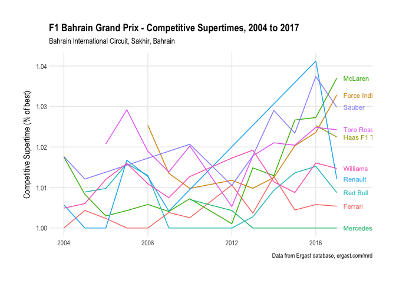

### Circuit Competitive Supertimes

*Supertimes* are often provided as a season wide performance metric for comparing performances over a season. At the manufacturer level, they are typically calculated for each manufacturer as the average of their fastest single lap recorded by the team at each race weekend expressed as a percentage of the fastest single lap overall.

We can also derive a reduced *competitive supertime* by basing the calculation on best laptime recorded across the qualifying and race sessions, omitting laptimes recorded in the practice sessions.

We can draw on the notion of supertimes to derive two simple measures for comparing team performances based on laptime:

  - evolution of manufacturer competitive supertime for a circuit over the years;
  - evolution of manufacturer competitive supertime for each circuit over the course of a season.

<!-- -->

We can also produce driver performance metrics based on the competitive supertime of each driver.

<!-- -->

| code |  avstime | races |
| :--- | -------: | ----: |
| HAM  | 1.003266 |    10 |
| VET  | 1.007769 |     9 |
| ALO  | 1.010742 |    12 |
| BOT  | 1.011088 |     5 |
| RIC  | 1.011662 |     6 |
| RAI  | 1.011808 |    10 |
| HUL  | 1.017749 |     7 |
| VER  | 1.022486 |     6 |
| PER  | 1.023558 |     6 |
| GRO  | 1.023875 |     2 |
| STR  | 1.027025 |     1 |
| SAI  | 1.027665 |     3 |
| OCO  | 1.032838 |     1 |
| VAN  | 1.033600 |     2 |
| MAG  | 1.034711 |     3 |
| ERI  | 1.035507 |     3 |
