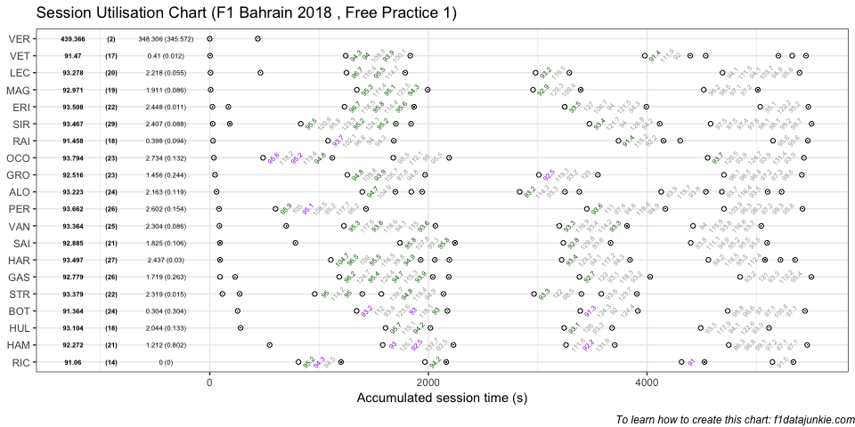

## Session Utilisation

Activity in Free Practice 1 took place as follows:

<!-- -->

### Performance Summary

| Driver            | Number | Fastest Lap |   Gap |  Diff |
| :---------------- | -----: | ----------: | ----: | ----: |
| Daniel RICCIARDO  |      3 |      91.060 | 0.000 | 0.000 |
| Valtteri BOTTAS   |     77 |      91.364 | 0.304 | 0.304 |
| Kimi RAIKKONEN    |      7 |      91.458 | 0.398 | 0.094 |
| Sebastian VETTEL  |      5 |      91.470 | 0.410 | 0.012 |
| Lewis HAMILTON    |     44 |      92.272 | 1.212 | 0.802 |
| Romain GROSJEAN   |      8 |      92.516 | 1.456 | 0.244 |
| Pierre GASLY      |     10 |      92.779 | 1.719 | 0.263 |
| Carlos SAINZ      |     55 |      92.885 | 1.825 | 0.106 |
| Kevin MAGNUSSEN   |     20 |      92.971 | 1.911 | 0.086 |
| Nico HULKENBERG   |     27 |      93.104 | 2.044 | 0.133 |
| Fernando ALONSO   |     14 |      93.223 | 2.163 | 0.119 |
| Charles LECLERC   |     16 |      93.278 | 2.218 | 0.055 |
| Stoffel VANDOORNE |      2 |      93.364 | 2.304 | 0.086 |
| Lance STROLL      |     18 |      93.379 | 2.319 | 0.015 |
| Sergey SIROTKIN   |     35 |      93.467 | 2.407 | 0.088 |
| Brendon HARTLEY   |     28 |      93.497 | 2.437 | 0.030 |
| Marcus ERICSSON   |      9 |      93.508 | 2.448 | 0.011 |
| Sergio PEREZ      |     11 |      93.662 | 2.602 | 0.154 |
| Esteban OCON      |     31 |      93.794 | 2.734 | 0.132 |

### Stints Summary

| Driver            | Total laps | Longest run (laps) | Stints |
| :---------------- | ---------: | -----------------: | -----: |
| Sergey SIROTKIN   |         29 |                 10 |      6 |
| Brendon HARTLEY   |         27 |                  9 |      8 |
| Sergio PEREZ      |         26 |                  9 |      4 |
| Pierre GASLY      |         26 |                  9 |      5 |
| Stoffel VANDOORNE |         25 |                  9 |      5 |
| Valtteri BOTTAS   |         24 |                  9 |      4 |
| Fernando ALONSO   |         24 |                  5 |      8 |
| Esteban OCON      |         23 |                  9 |      4 |
| Romain GROSJEAN   |         23 |                  8 |      4 |
| Marcus ERICSSON   |         22 |                  8 |      5 |
| Lance STROLL      |         22 |                  6 |      6 |
| Lewis HAMILTON    |         21 |                  8 |      4 |
| Carlos SAINZ      |         21 |                  8 |      5 |
| Charles LECLERC   |         20 |                  8 |      5 |
| Kevin MAGNUSSEN   |         19 |                  7 |      4 |
| Nico HULKENBERG   |         18 |                  7 |      4 |
| Kimi RAIKKONEN    |         18 |                  7 |      5 |
| Sebastian VETTEL  |         17 |                  7 |      6 |
| Daniel RICCIARDO  |         14 |                  5 |      4 |
| Max VERSTAPPEN    |          2 |                  1 |      2 |

  - Sergey SIROTKIN completed 29 laps over 6 stints, with a longest run
    of 10 laps

  - Brendon HARTLEY completed 27 laps over 8 stints, with a longest run
    of 9 laps

  - Sergio PEREZ completed 26 laps over 4 stints, with a longest run of
    9 laps

  - Pierre GASLY completed 26 laps over 5 stints, with a longest run of
    9 laps

  - Stoffel VANDOORNE completed 25 laps over 5 stints, with a longest
    run of 9 laps

  - Valtteri BOTTAS completed 24 laps over 4 stints, with a longest run
    of 9 laps

  - Fernando ALONSO completed 24 laps over 8 stints, with a longest run
    of 5 laps

  - Esteban OCON completed 23 laps over 4 stints, with a longest run of
    9 laps

  - Romain GROSJEAN completed 23 laps over 4 stints, with a longest run
    of 8 laps

  - Marcus ERICSSON completed 22 laps over 5 stints, with a longest run
    of 8 laps

  - Lance STROLL completed 22 laps over 6 stints, with a longest run of
    6 laps

  - Lewis HAMILTON completed 21 laps over 4 stints, with a longest run
    of 8 laps

  - Carlos SAINZ completed 21 laps over 5 stints, with a longest run of
    8 laps

  - Charles LECLERC completed 20 laps over 5 stints, with a longest run
    of 8 laps

  - Kevin MAGNUSSEN completed 19 laps over 4 stints, with a longest run
    of 7 laps

  - Nico HULKENBERG completed 18 laps over 4 stints, with a longest run
    of 7 laps

  - Kimi RAIKKONEN completed 18 laps over 5 stints, with a longest run
    of 7 laps

  - Sebastian VETTEL completed 17 laps over 6 stints, with a longest run
    of 7 laps

  - Daniel RICCIARDO completed 14 laps over 4 stints, with a longest run
    of 5 laps

  - Max VERSTAPPEN completed 2 laps over 2 stints, with a longest run of
    1 laps

-----

This website is unofficial and is not associated in any way with the
Formula 1 companies. F1, FORMULA ONE, FORMULA 1, FIA FORMULA ONE WORLD
CHAMPIONSHIP, GRAND PRIX and related marks are trade marks of Formula
One Licensing B.V.
