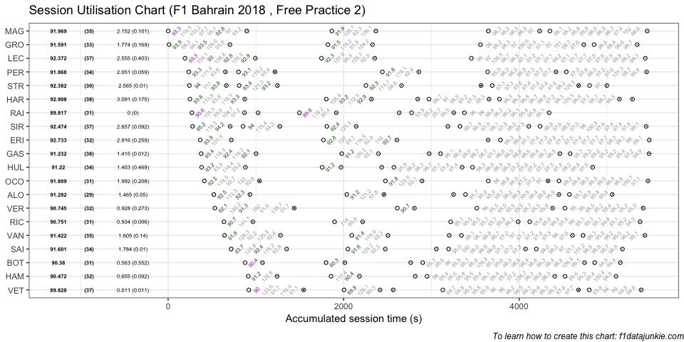

## Session Utilisation

Activity in Free Practice 2 took place as follows:

<!-- -->

### Performance Summary

| Driver            | Number | Fastest Lap |   Gap |  Diff |
| :---------------- | -----: | ----------: | ----: | ----: |
| Kimi RAIKKONEN    |      7 |      89.817 | 0.000 | 0.000 |
| Sebastian VETTEL  |      5 |      89.828 | 0.011 | 0.011 |
| Valtteri BOTTAS   |     77 |      90.380 | 0.563 | 0.552 |
| Lewis HAMILTON    |     44 |      90.472 | 0.655 | 0.092 |
| Max VERSTAPPEN    |     33 |      90.745 | 0.928 | 0.273 |
| Daniel RICCIARDO  |      3 |      90.751 | 0.934 | 0.006 |
| Nico HULKENBERG   |     27 |      91.220 | 1.403 | 0.469 |
| Pierre GASLY      |     10 |      91.232 | 1.415 | 0.012 |
| Fernando ALONSO   |     14 |      91.282 | 1.465 | 0.050 |
| Stoffel VANDOORNE |      2 |      91.422 | 1.605 | 0.140 |
| Romain GROSJEAN   |      8 |      91.591 | 1.774 | 0.169 |
| Carlos SAINZ      |     55 |      91.601 | 1.784 | 0.010 |
| Esteban OCON      |     31 |      91.809 | 1.992 | 0.208 |
| Sergio PEREZ      |     11 |      91.868 | 2.051 | 0.059 |
| Kevin MAGNUSSEN   |     20 |      91.969 | 2.152 | 0.101 |
| Charles LECLERC   |     16 |      92.372 | 2.555 | 0.403 |
| Lance STROLL      |     18 |      92.382 | 2.565 | 0.010 |
| Sergey SIROTKIN   |     35 |      92.474 | 2.657 | 0.092 |
| Marcus ERICSSON   |      9 |      92.733 | 2.916 | 0.259 |
| Brendon HARTLEY   |     28 |      92.908 | 3.091 | 0.175 |

### Stints Summary

| Driver            | Total laps | Longest run (laps) | Stints |
| :---------------- | ---------: | -----------------: | -----: |
| Pierre GASLY      |         38 |                 15 |      5 |
| Brendon HARTLEY   |         38 |                 15 |      6 |
| Charles LECLERC   |         37 |                 21 |      3 |
| Sebastian VETTEL  |         37 |                 17 |      5 |
| Sergey SIROTKIN   |         37 |                 13 |      6 |
| Stoffel VANDOORNE |         35 |                 14 |      5 |
| Kevin MAGNUSSEN   |         35 |                 12 |      4 |
| Nico HULKENBERG   |         34 |                 15 |      5 |
| Carlos SAINZ      |         34 |                 11 |      5 |
| Sergio PEREZ      |         34 |                 10 |      5 |
| Romain GROSJEAN   |         33 |                 13 |      4 |
| Marcus ERICSSON   |         32 |                 18 |      4 |
| Lewis HAMILTON    |         32 |                 16 |      5 |
| Max VERSTAPPEN    |         32 |                 10 |      4 |
| Valtteri BOTTAS   |         31 |                 20 |      5 |
| Daniel RICCIARDO  |         31 |                 14 |      4 |
| Kimi RAIKKONEN    |         31 |                 11 |      6 |
| Esteban OCON      |         31 |                 11 |      4 |
| Lance STROLL      |         30 |                 11 |      6 |
| Fernando ALONSO   |         29 |                 12 |      5 |

  - Pierre GASLY completed 38 laps over 5 stints, with a longest run of
    15 laps

  - Brendon HARTLEY completed 38 laps over 6 stints, with a longest run
    of 15 laps

  - Charles LECLERC completed 37 laps over 3 stints, with a longest run
    of 21 laps

  - Sebastian VETTEL completed 37 laps over 5 stints, with a longest run
    of 17 laps

  - Sergey SIROTKIN completed 37 laps over 6 stints, with a longest run
    of 13 laps

  - Stoffel VANDOORNE completed 35 laps over 5 stints, with a longest
    run of 14 laps

  - Kevin MAGNUSSEN completed 35 laps over 4 stints, with a longest run
    of 12 laps

  - Nico HULKENBERG completed 34 laps over 5 stints, with a longest run
    of 15 laps

  - Carlos SAINZ completed 34 laps over 5 stints, with a longest run of
    11 laps

  - Sergio PEREZ completed 34 laps over 5 stints, with a longest run of
    10 laps

  - Romain GROSJEAN completed 33 laps over 4 stints, with a longest run
    of 13 laps

  - Marcus ERICSSON completed 32 laps over 4 stints, with a longest run
    of 18 laps

  - Lewis HAMILTON completed 32 laps over 5 stints, with a longest run
    of 16 laps

  - Max VERSTAPPEN completed 32 laps over 4 stints, with a longest run
    of 10 laps

  - Valtteri BOTTAS completed 31 laps over 5 stints, with a longest run
    of 20 laps

  - Daniel RICCIARDO completed 31 laps over 4 stints, with a longest run
    of 14 laps

  - Kimi RAIKKONEN completed 31 laps over 6 stints, with a longest run
    of 11 laps

  - Esteban OCON completed 31 laps over 4 stints, with a longest run of
    11 laps

  - Lance STROLL completed 30 laps over 6 stints, with a longest run of
    11 laps

  - Fernando ALONSO completed 29 laps over 5 stints, with a longest run
    of 12 laps

-----

This website is unofficial and is not associated in any way with the
Formula 1 companies. F1, FORMULA ONE, FORMULA 1, FIA FORMULA ONE WORLD
CHAMPIONSHIP, GRAND PRIX and related marks are trade marks of Formula
One Licensing B.V.