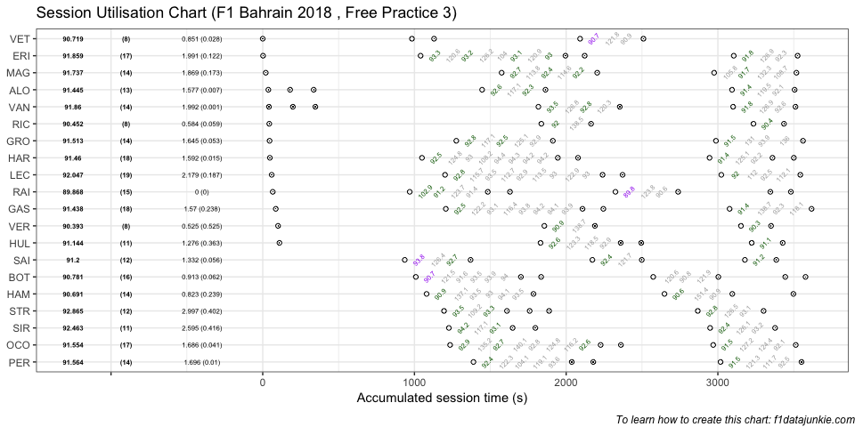
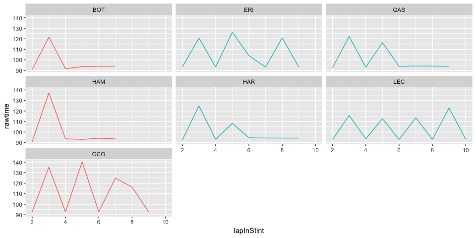

## Session Utilisation

Activity in Free Practice 3 took place as follows:

<!-- -->

### Stints Summary

| Driver            | Total laps | Longest run (laps) | Stints |
| :---------------- | ---------: | -----------------: | -----: |
| Charles LECLERC   |         19 |                 11 |      4 |
| Pierre GASLY      |         18 |                 10 |      4 |
| Brendon HARTLEY   |         18 |                 10 |      5 |
| Marcus ERICSSON   |         17 |                 10 |      4 |
| Esteban OCON      |         17 |                 10 |      3 |
| Valtteri BOTTAS   |         16 |                  8 |      5 |
| Kimi RAIKKONEN    |         15 |                  6 |      6 |
| Lewis HAMILTON    |         14 |                  8 |      3 |
| Sergio PEREZ      |         14 |                  7 |      3 |
| Romain GROSJEAN   |         14 |                  7 |      3 |
| Kevin MAGNUSSEN   |         14 |                  7 |      3 |
| Stoffel VANDOORNE |         14 |                  6 |      5 |
| Fernando ALONSO   |         13 |                  5 |      5 |
| Lance STROLL      |         12 |                  5 |      4 |
| Carlos SAINZ      |         12 |                  5 |      3 |
| Nico HULKENBERG   |         11 |                  6 |      4 |
| Sergey SIROTKIN   |         11 |                  5 |      3 |
| Sebastian VETTEL  |          8 |                  5 |      3 |
| Max VERSTAPPEN    |          8 |                  4 |      3 |
| Daniel RICCIARDO  |          8 |                  4 |      3 |

  - Charles LECLERC completed 19 laps over 4 stints, with a longest run
    of 11 laps

  - Pierre GASLY completed 18 laps over 4 stints, with a longest run of
    10 laps

  - Brendon HARTLEY completed 18 laps over 5 stints, with a longest run
    of 10 laps

  - Marcus ERICSSON completed 17 laps over 4 stints, with a longest run
    of 10 laps

  - Esteban OCON completed 17 laps over 3 stints, with a longest run of
    10 laps

  - Valtteri BOTTAS completed 16 laps over 5 stints, with a longest run
    of 8 laps

  - Kimi RAIKKONEN completed 15 laps over 6 stints, with a longest run
    of 6 laps

  - Lewis HAMILTON completed 14 laps over 3 stints, with a longest run
    of 8 laps

  - Sergio PEREZ completed 14 laps over 3 stints, with a longest run of
    7 laps

  - Romain GROSJEAN completed 14 laps over 3 stints, with a longest run
    of 7 laps

  - Kevin MAGNUSSEN completed 14 laps over 3 stints, with a longest run
    of 7 laps

  - Stoffel VANDOORNE completed 14 laps over 5 stints, with a longest
    run of 6 laps

  - Fernando ALONSO completed 13 laps over 5 stints, with a longest run
    of 5 laps

  - Lance STROLL completed 12 laps over 4 stints, with a longest run of
    5 laps

  - Carlos SAINZ completed 12 laps over 3 stints, with a longest run of
    5 laps

  - Nico HULKENBERG completed 11 laps over 4 stints, with a longest run
    of 6 laps

  - Sergey SIROTKIN completed 11 laps over 3 stints, with a longest run
    of 5 laps

  - Sebastian VETTEL completed 8 laps over 3 stints, with a longest run
    of 5 laps

  - Max VERSTAPPEN completed 8 laps over 3 stints, with a longest run of
    4 laps

  - Daniel RICCIARDO completed 8 laps over 3 stints, with a longest run
    of 4 laps

### Long Runs

Laptimes on long runs of 8 or more laps
<!-- -->

### Performance Summary

| Driver            | Number | Fastest Lap |   Gap |  Diff |
| :---------------- | -----: | ----------: | ----: | ----: |
| Kimi RAIKKONEN    |      7 |      89.868 | 0.000 | 0.000 |
| Max VERSTAPPEN    |     33 |      90.393 | 0.525 | 0.525 |
| Daniel RICCIARDO  |      3 |      90.452 | 0.584 | 0.059 |
| Lewis HAMILTON    |     44 |      90.691 | 0.823 | 0.239 |
| Sebastian VETTEL  |      5 |      90.719 | 0.851 | 0.028 |
| Valtteri BOTTAS   |     77 |      90.781 | 0.913 | 0.062 |
| Nico HULKENBERG   |     27 |      91.144 | 1.276 | 0.363 |
| Carlos SAINZ      |     55 |      91.200 | 1.332 | 0.056 |
| Pierre GASLY      |     10 |      91.438 | 1.570 | 0.238 |
| Fernando ALONSO   |     14 |      91.445 | 1.577 | 0.007 |
| Brendon HARTLEY   |     28 |      91.460 | 1.592 | 0.015 |
| Romain GROSJEAN   |      8 |      91.513 | 1.645 | 0.053 |
| Esteban OCON      |     31 |      91.554 | 1.686 | 0.041 |
| Sergio PEREZ      |     11 |      91.564 | 1.696 | 0.010 |
| Kevin MAGNUSSEN   |     20 |      91.737 | 1.869 | 0.173 |
| Marcus ERICSSON   |      9 |      91.859 | 1.991 | 0.122 |
| Stoffel VANDOORNE |      2 |      91.860 | 1.992 | 0.001 |
| Charles LECLERC   |     16 |      92.047 | 2.179 | 0.187 |
| Sergey SIROTKIN   |     35 |      92.463 | 2.595 | 0.416 |
| Lance STROLL      |     18 |      92.865 | 2.997 | 0.402 |

-----

This website is unofficial and is not associated in any way with the
Formula 1 companies. F1, FORMULA ONE, FORMULA 1, FIA FORMULA ONE WORLD
CHAMPIONSHIP, GRAND PRIX and related marks are trade marks of Formula
One Licensing B.V.
