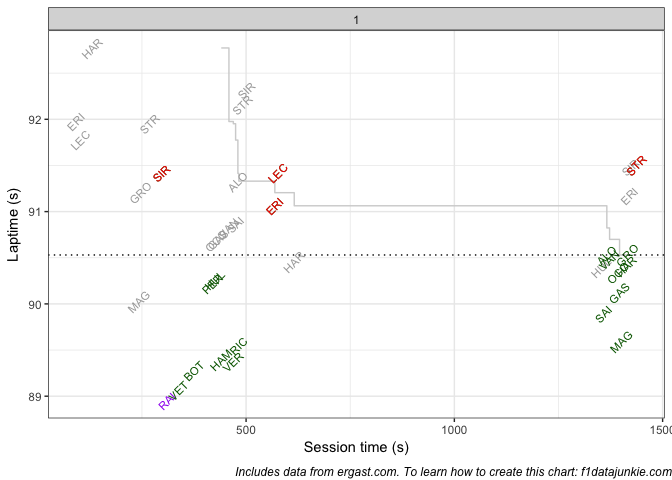
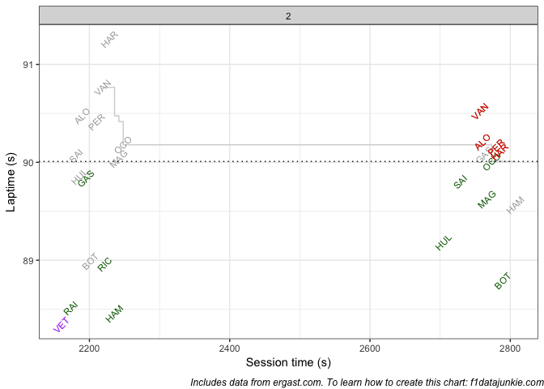
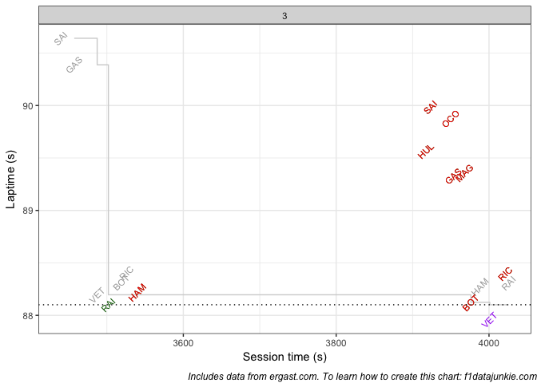

Drivers progressed through the qualifying session as follows:

<!-- -->

Going from Q1 to Q2:

  - MAG failed to improve his time, recording 89.623 compared to 89.594
    (0.029s slower)

  - VAN failed to improve his time, recording 90.525 compared to 90.479
    (0.046s slower)

Going from Q2 to Q3:

  - HUL failed to improve his time, recording 89.57 compared to 89.187
    (0.383s slower)

  - SAI failed to improve his time, recording 89.986 compared to 89.802
    (0.184s slower)

<!-- -->

The official session results were recorded as follows:

| POS | DRIVER | Q1            | Q2            | Q3            |
| --: | :----- | :------------ | :------------ | :------------ |
|   1 | VET    | 1:29.060 (2)  | 1:28.341 (1)  | 1:27.958 (1)  |
|   2 | RAI    | 1:28.951 (1)  | 1:28.515 (3)  | 1:28.101 (2)  |
|   3 | BOT    | 1:29.275 (3)  | 1:28.794 (4)  | 1:28.124 (3)  |
|   4 | HAM    | 1:29.396 (5)  | 1:28.458 (2)  | 1:28.220 (4)  |
|   5 | RIC    | 1:29.552 (6)  | 1:28.962 (5)  | 1:28.398 (5)  |
|   6 | GAS    | 1:30.121 (9)  | 1:29.836 (9)  | 1:29.329 (6)  |
|   7 | MAG    | 1:29.594 (7)  | 1:29.623 (7)  | 1:29.358 (7)  |
|   8 | HUL    | 1:30.260 (11) | 1:29.187 (6)  | 1:29.570 (8)  |
|   9 | OCO    | 1:30.338 (12) | 1:30.009 (10) | 1:29.874 (9)  |
|  10 | SAI    | 1:29.893 (8)  | 1:29.802 (8)  | 1:29.986 (10) |
|  11 | HAR    | 1:30.412 (13) | 1:30.105 (11) |               |
|  12 | PER    | 1:30.218 (10) | 1:30.156 (12) |               |
|  13 | ALO    | 1:30.530 (15) | 1:30.212 (13) |               |
|  14 | VAN    | 1:30.479 (14) | 1:30.525 (14) |               |
|  15 | VER    | 1:29.374 (4)  |               |               |
|  16 | GRO    | 1:30.530 (15) |               |               |
|  17 | ERI    | 1:31.063 (17) |               |               |
|  18 | SIR    | 1:31.414 (18) |               |               |
|  19 | LEC    | 1:31.420 (19) |               |               |
|  20 | STR    | 1:31.503 (20) |               |               |

## Session Utilisation

Activity throughout the three qualification sessions took place as
follows:

<!-- -->

## Q1

<!-- -->

### Cut-off Time Evolution

The cut-off time in Q1 evolved as follows:
<!-- -->

## Q2

<!-- -->

### Cut-off Time Evolution

The cut-off time in Q2 evolved as follows:
<!-- -->

## Q3

<!-- -->

### Front Row Cut-off Time Evolution

The cut-off time in Q3 evolved as follows:
<!-- -->

-----

To learn how to wrangle F1 results and timing data to create charts like
these, see [f1datajunkie.com](https://f1datajunkie.com) or [buy the
*Wrangling F1 Data With R*
book](https://leanpub.com/wranglingf1datawithr).
